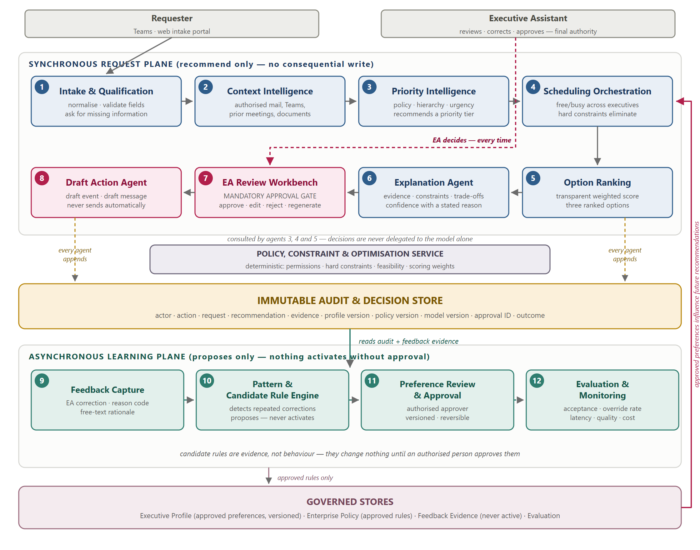

# Executive Time Management Copilot

A governed, agentic meeting-scheduling copilot for Executive Assistants. The system **recommends and drafts**; the EA decides.

> The agent may observe, research, qualify, recommend, and draft. It may not accept, decline, cancel, move, or send an executive meeting invitation. Every calendar write is preceded by a recorded EA approval event.

**Status:** specification complete, implementation not started.

## What it does

Turns fragmented meeting requests into qualified, context-rich, ranked, explainable recommendations — and learns an executive's preferences from the corrections the EA was already making, without ever changing its own behaviour unsupervised.

Three MVP scenarios:

1. **Qualified single-executive scheduling** — an incomplete request is qualified by the agent, enriched with authorised context, and returned as three ranked options with explanations.
2. **Multi-executive strategic scheduling** — conflict-aware coordination across constrained calendars, with hard constraints eliminating options and trade-offs shown rather than actioned.
3. **EA feedback-to-preference learning** — repeated corrections become a proposed rule that changes nothing until an authorised person approves it, then visibly changes the next recommendation.

## Start here

| You want to | Read |
|---|---|
| Build it | [`AGENTS.md`](AGENTS.md), then [`docs/00-INDEX.md`](docs/00-INDEX.md) |
| Understand the design | [`docs/02-architecture.md`](docs/02-architecture.md) |
| Know what "done" means | [`docs/06-e2e-test-cases.md`](docs/06-e2e-test-cases.md) |
| Review it as a stakeholder | `docs/Executive-Time-Management-Copilot-Architecture-MVP.docx` |

## Design in one paragraph

Two planes joined by an append-only audit store. The **synchronous plane** (agents 1–8) answers a request in seconds and never writes without an approval event. The **asynchronous plane** (agents 9–12) reads history and proposes preference rules it has no power to activate. A CP-SAT solver owns feasibility, a weighted score owns ranking, and a language model owns only language — extraction, summarisation, and explanation. Everything non-deterministic sits behind a port with a fake, so the full test suite runs offline on a clean clone.



## Quick start

```bash
pip install -e ".[dev]"
pytest                              # full suite — no tenant or API key needed
python -m ea_copilot.cli.demo       # scripted nine-beat demo
uvicorn ea_copilot.api.app:app --reload
```

## Layout

```
AGENTS.md                 build contract for the coding harness
config/                   weights, policy, locations, settings
docs/                     specifications (authoritative) + diagrams
src/ea_copilot/
  domain/                 models, enums, errors — pure
  ports/                  m365, llm, clock protocols
  adapters/               fakes (default) + real implementations
  services/               policy, solver, scoring, audit, patterns — pure
  agents/                 a01_intake … a12_evaluation
  api/  cli/
tests/
  unit/ integration/ e2e/ fixtures/
```

## Stack

Python 3.13 · FastAPI · Pydantic v2 · SQLAlchemy 2 (SQLite) · OR-Tools CP-SAT · pytest

Target deployment is Microsoft Foundry Agent Service with Work IQ through Toolbox and Entra Agent ID. The `M365Port` abstraction makes that migration a change of adapter rather than a rewrite — see [`docs/05-ports-and-adapters.md`](docs/05-ports-and-adapters.md).
