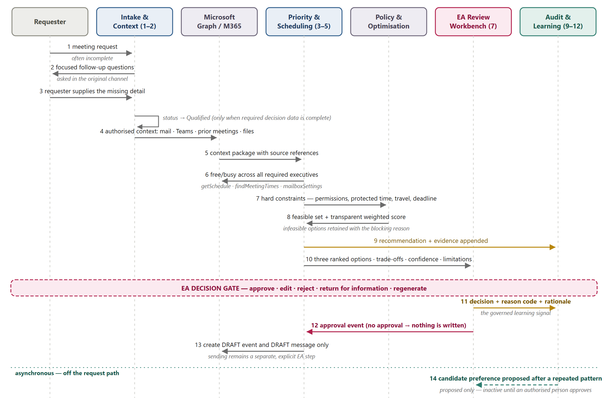
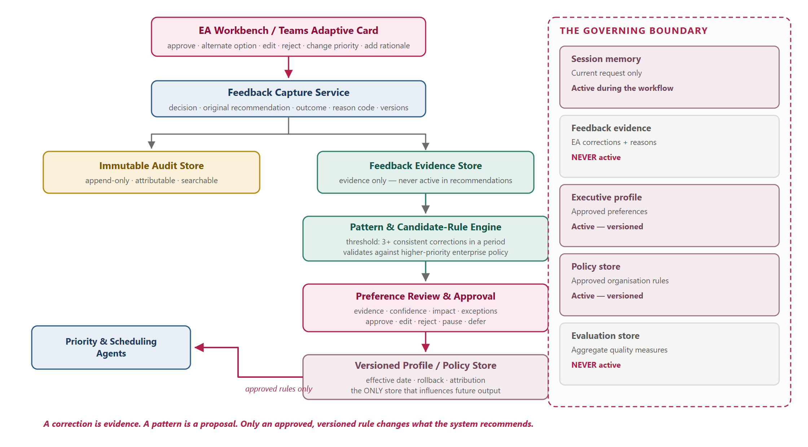
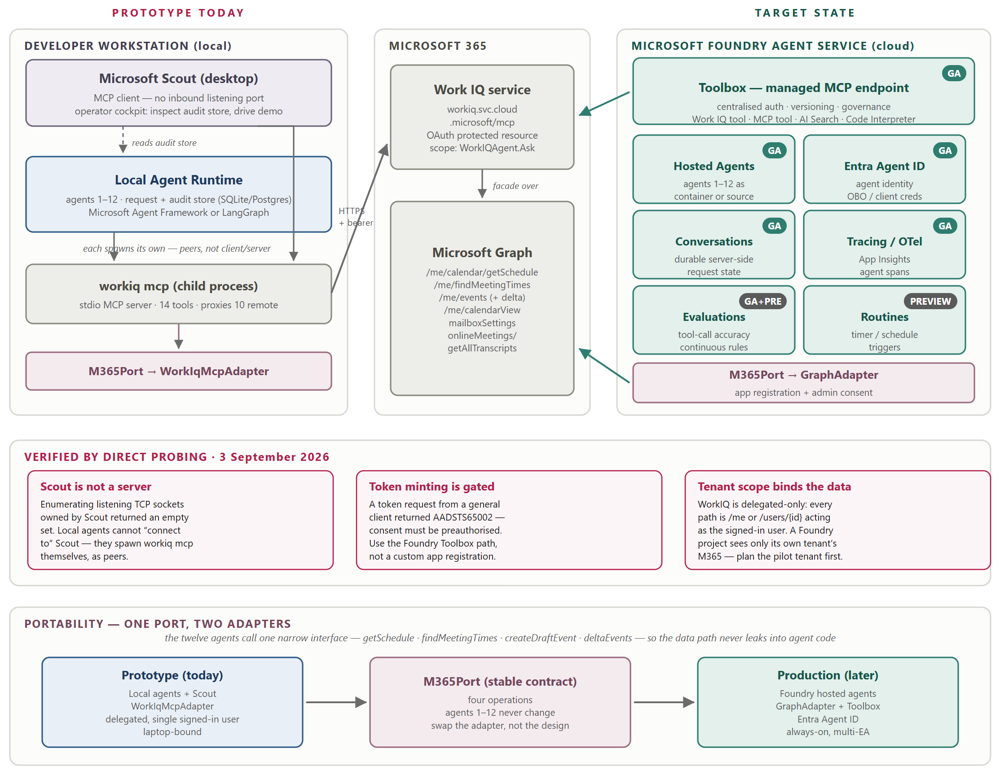

# 02 — Architecture

## 1. Shape

Two planes joined by one append-only store.


The **synchronous plane** (agents 1–8) answers a request in seconds and is on the critical path. The **asynchronous plane** (agents 9–12) reads history and proposes improvements, and is never on the critical path. The **audit store** is the only thing they share: the synchronous plane writes it, the asynchronous plane reads it, and nothing else crosses.

This separation buys three properties worth protecting:

- A failure in learning cannot break scheduling.
- A ranking change can be rolled back without redeploying the request path.
- The learning plane can move to different infrastructure without touching the agents that serve users.

## 2. The gate

Agent 7 is a hard boundary, not a step. Everything upstream **recommends**; only agent 8 writes, and only when an `ApprovalEvent` exists.

Implement the gate as a precondition inside `a08_draft_action.py` rather than a check in the API layer. A caller reaching the agent directly must hit the same wall:

```python
def create_draft(self, recommendation_id: str, actor: str) -> DraftEvent:
    approval = self._audit.find_approval(recommendation_id)
    if approval is None:
        raise ApprovalRequiredError(recommendation_id)
    ...
```

Enforcing at the edge would leave the invariant one refactor away from silently lapsing.

## 3. Deterministic core

Layers, innermost first. Each depends only on layers above it in this list.

| Layer | Package | May do | Never does |
|---|---|---|---|
| Domain | `domain/` | Define models, enums, errors | I/O, time, randomness |
| Services | `services/` | Pure computation: policy, scoring, pattern detection | I/O, time, randomness |
| Ports | `ports/` | Declare protocols | Implement them |
| Adapters | `adapters/` | Talk to M365, LLMs, the clock, the database | Contain business rules |
| Agents | `agents/` | Orchestrate services through ports | Reach an adapter directly |
| API / CLI | `api/`, `cli/` | Translate HTTP or argv to agent calls | Contain business rules |

Agents receive ports by constructor injection. An agent that imports from `adapters/` is a layering bug — `tests/unit/test_layering.py` asserts the import graph.

**Why the core is pure.** `services/scoring.py` taking a `FeasibleSet` and returning `RankedOptions` is testable with a table of tuples, and reproducible: the same input gives the same output forever. That is what makes `NFR-02` and `FR-805` (replay) achievable rather than aspirational.

## 4. Where intelligence is allowed

| Decision | Owner | Reason |
|---|---|---|
| Is this slot feasible? | CP-SAT solver | Must be exhaustive and explainable |
| Does this person have permission? | `services/policy.py` | Security decision |
| What priority tier? | `services/policy.py` from `config/policy.yaml` | Auditable business rule |
| How do options rank? | `services/scoring.py` from `config/weights.yaml` | Reproducible and tunable |
| What fields are missing? | `services/validation.py` | Deterministic |
| How to phrase a follow-up question | `LlmPort` | Language work |
| How to summarise retrieved context | `LlmPort` | Language work |
| How to explain a ranking in prose | `LlmPort` | Language work |
| What reason code fits this free text | `LlmPort` | Language work |

The model writes and reads language. It decides nothing that a reviewer would need to audit. Where a model produces structure, constrain it with a Pydantic schema and validate before use.

## 5. Request flow



```
POST /requests
   → a01 intake            status: Draft → NeedsInfo | Qualified
   → a02 context           ContextPackage (every claim sourced)
   → a03 priority          PriorityRecommendation (tier + factors)
   → a04 scheduling        FeasibleSet (hard constraints only)
   → a05 ranking           RankedOptions (top 3, per-term scores)
   → a06 explanation       RecommendationPacket
   → audit.append(...)
   → a07 workbench         AwaitingEAReview          ◄── STOP
POST /requests/{id}/decision
   → audit.append(ApprovalEvent)
   → a08 draft action      create_draft_event  (unsent)
   → a09 feedback capture  FeedbackEvent → evidence store
```

Everything after `a09` runs on a schedule, off the request path.

## 6. Governed learning



Four stores with different rules. Getting these mixed up is how a memory-augmented system becomes unpredictable, so the distinction is structural:

| Store | Written by | Read during a request? |
|---|---|---|
| Session state | The current request | Yes, within that request |
| Audit store | Every agent, own records only | No — evidence and replay |
| Feedback evidence | Agent 9 | **No** |
| Executive profile | Agent 11, on approval | **Yes** |
| Policy store | Policy owner, on approval | **Yes** |
| Evaluation store | Agent 12 | No |

Only the profile and policy stores influence output, and both accept writes only through an approval path. A correction is evidence; a pattern is a proposal; an approved rule is behaviour.

## 7. Ports

Three protocols isolate everything non-deterministic. `05-ports-and-adapters.md` specifies them; the reason they exist is here.

The prototype runs locally against Work IQ; the target state runs in Microsoft Foundry against Graph. Both bind the same `M365Port`, so the migration swaps an adapter rather than rewriting agents.



Two constraints established by probing the live environment, both of which shape the target state:

- Work IQ is a preauthorised first-party API. A custom app registration cannot mint a token for it (`AADSTS65002`), so cloud access goes through the Foundry Toolbox where Work IQ is a GA tool.
- Work IQ access is delegated — every path acts as the signed-in user. A Foundry project sees only its own tenant's Microsoft 365, which makes the pilot tenant choice a prerequisite rather than a detail.

## 8. Configuration

Behaviour that a business owner would want to change lives in YAML, not in code:

| File | Contains |
|---|---|
| `config/weights.yaml` | The six scoring weights |
| `config/policy.yaml` | Priority tiers, hierarchy, protected-time rules |
| `config/locations.yaml` | Offices and travel times |
| `config/settings.yaml` | Thresholds, feature flags, adapter selection |

Load through `config.py` into a Pydantic `Settings` object. Environment variables override file values; secrets come only from the environment.

## 9. Target platform

For the Foundry deployment (later, not needed for the MVP build):

| Capability | Service | Status |
|---|---|---|
| Agent hosting | Foundry hosted agents | GA |
| Tool access | Toolbox managed MCP endpoint | GA |
| M365 data | Work IQ tool in Toolbox | GA |
| Agent identity | Entra Agent ID | GA |
| Request state | Conversations | GA |
| Tracing | OpenTelemetry → Application Insights | GA |
| Evaluation | Tool-call accuracy, continuous rules | GA / preview |
| Scheduled runs | Routines | Preview |

Foundry Workflows retires 1 December 2026 — build orchestration on Microsoft Agent Framework instead.
